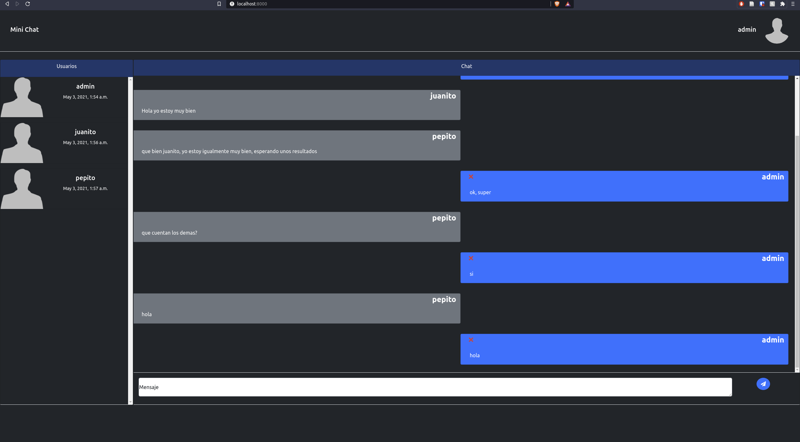

# Mini Chat

## Configurar django

Crear ambiente virtual

```
python -m virtualenv env
```

Entrar al ambiente
```
source env/bin/activate
```

Instalar requerimientos

```
pip install -r requirements.txt
```
---
## Crear base de datos

Crear base de datos chat_db
```
psql createdb  chat_db;
```
Crear usuario
```
CREATE USER django_chat WITH PASSWORD 'chatpass';
```
Dar permisos al usuario
```
grant all privileges on database chat_db to django_chat;
```
Tambien se puede ejecutar el archivo  [**create_db.sh**](create_db.sh)
```
sudo ./create_db.sh
```
---
## Ejecutar app
Entrar a la carpeta del proyecto src

```
cd src
```
Hacer migraciones

```
python manage.py makemigrations
```

Implementar migraciones

```
python manage.py migrate
```
Crear superusuario
```
python manage.py createsuperuser
```
Correr servidor 
```
python manage.py runserver
```
---
Tambien es posible usar una backup de una base de datos con informacion [**chat_db.sql**](chat_db.sql)
```
psql -U postgres -W -h localhost chat_db < chat_db.sql
```
Usuario de ejemplo:
* usuario: admin@gmail.com  
* contraseña: admin123

---
